# Universidad Católica del Uruguay
 

## Facultad de Ingeniería y Tecnologías
### Programación II

## Template para entrega de ejercicios.

### Introducción
El siguiente repositorio fue creado con el objetivo de 
ayudarte en la organización de las entregas de tus ejercicios
prácticos. La solución contenida en este repositorio se compone de tres tipos de proyectos:

1. Consola
2. Biblioteca de clases
3. Test (NUnit)

### Estructura
La solución se estructura de la siguiente manera.

    .
    ├── assets  (Imagénes o multimedia)
    ├── docs    (Documentación del proyecto)
    ├── README.md   (Información general del proyecto)
    ├── src         
    │   ├── Library (Proyecto de biblioteca de clases)
    │   │   ├── Car.cs
    │   │   └── Library.csproj
    │   ├── Program (Proyecto de consola)
    │   │   ├── Program.cs
    │   │   └── Program.csproj
    │   └── test
    │       └── Test.Library (proyecto de Test Nunit)
    │           ├── CarTest.cs
    │           └── Test.Library.csproj
    └── TemplateEjercicio.sln (Archivo de solución)


### Correctitud
La calidad y correctitud de tu código es muy importante, por tal motivo hemos configurado dentro del template un pequeño archivo el cual ejecuta varias tareas, dentro de las cuales se verifica si tu programa compila y tus casos de pruebas se ejecutan exitosamente.

### Uso

1. Para utilizar este repositorio, como entrega de ejercicio has click en el botón 

    
2. En la siguiente pantalla debes de selecionar tu cuenta de github del combo de **owner**
    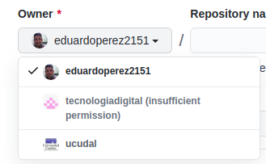

3. Nombrar el repositorio

    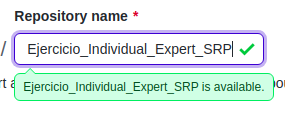

4. Crearlo como un repositorio público

    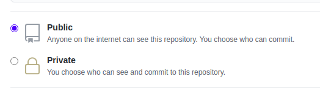

5. Finalmente hacer click en el botón

    

6. Y ya tenemos nuestro repositorio listo para ser utilizado.

    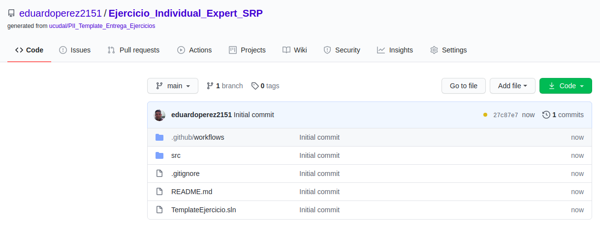

7. Es importante verificar la correcta compilación y ejecución de los test de nuestro proyecto. Para relizar este chequeo podemos ver un tick de color verde en el identificador del último commit realizado.

    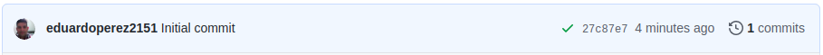
    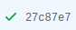

    si hacemos click sobre este tick podemos ver un popup el cual nos muestra el resultado de las tareas que se realizaron y en **"Details"**, podemos examinar que tareas se ejecutaron.

    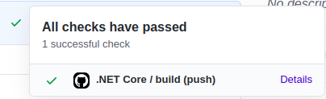
    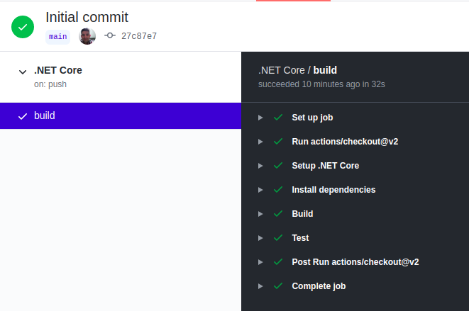

### Comandos

Para compilar nuestra solucion basta con pararnos en la raiz del proyecto y ejecutar

```
dotnet build
```
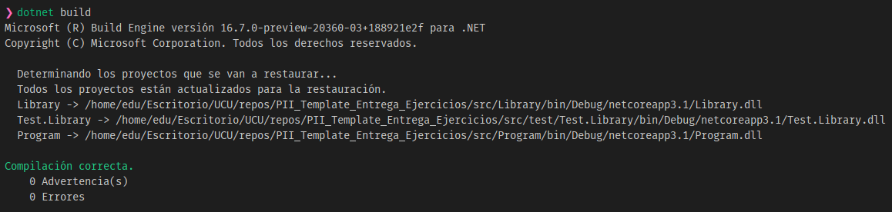


Para ejecutar nuestros casos de pruebas nos pararnos en la raiz del proyecto y ejecutamos
```
dotnet test
```
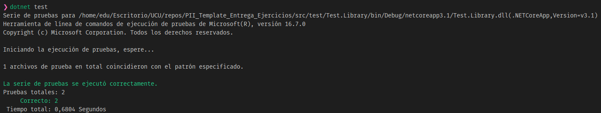

Para ejecutar nuestro programa principal o proyecto de consola (Program) nos pararnos en la raiz del proyecto y ejecutamos
```
dotnet run --project src/Program
```
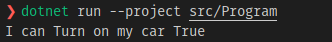


> ⚠ Información
>
>Para realizar este template nos basamos en los comando que se encuentran disponibles en el repositorio de [Comandos](https://github.com/ucudal/PII_Comandos). Las tareas de verificación fueron configuradas utilizando las caracteristicas que [GitHub Action](https://github.com/features/actions) nos ofrece.